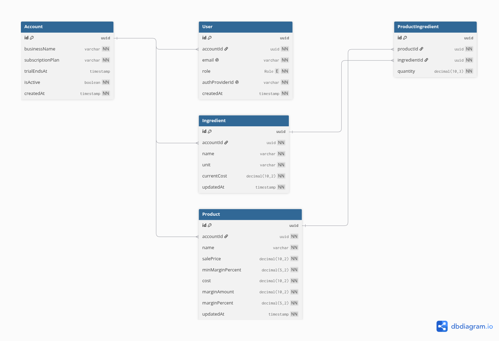
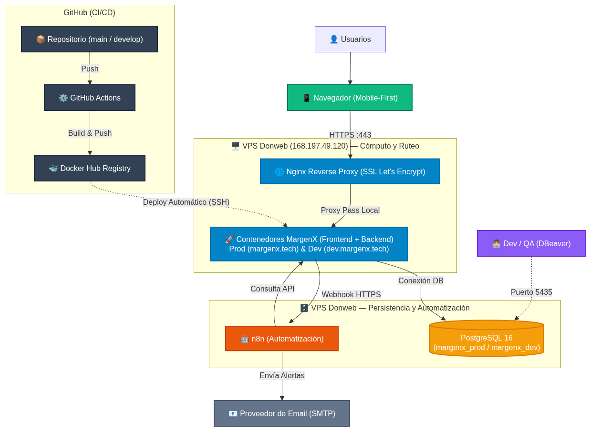

# Documento de Arquitectura de Software

## Proyecto: MargenX — Control de Márgenes en Tiempo Real

---

## 0. Estructura del Equipo

El equipo está compuesto por 4 personas. El Scrum Master ya asume los roles de **Scrum Master, DevOps y Arquitecto de Automatización (n8n)**. Los 3 roles restantes se asignan de forma estratégica para cubrir todo el ciclo de vida del producto sin solapamientos innecesarios ni cuellos de botella.

### Rol 1 — Scrum Master, DevOps & Arquitecto de Automatización

**Responsabilidad principal:** dueño de la infraestructura y el despliegue continuo en la VPS Donweb, la arquitectura de automatizaciones satélite con n8n, la gobernanza técnica del repositorio y la facilitación del marco ágil (Scrum). Es quien garantiza la estabilidad operativa del entorno, la seguridad perimetral, la ejecución atómica de migraciones y la eliminación de bloqueos técnicos y de flujo para el equipo.

- Facilitación de ceremonias ágiles (Planning, Dailies, Review, Retrospectivas) y automatización del tablero Kanban de GitHub Projects v2 mediante GitHub Actions y GraphQL API.
- Diseño, aprovisionamiento y mantenimiento de la infraestructura consolidada en la VPS Donweb (Ubuntu 22.04 LTS, Docker Compose, red interna `margenx_network` y proxy inverso Nginx nativo en el host con certificados SSL Let's Encrypt).
- Implementación y evolución de los pipelines de CI/CD en GitHub Actions (validaciones de código, compilación de imágenes Docker inmutables en Docker Hub y despliegue continuo vía SSH con ejecución atómica de migraciones de Prisma).
- Aprovisionamiento, securización y administración del orquestador satélite n8n desacoplado del monolito, gestionando workflows de alertas de margen y reportes semanales.
- Configuración de políticas de gobierno del repositorio: reglas de protección de ramas (branch protection en main y develop), plantillas obligatorias de Pull Request y canal de notificaciones automáticas de CI/CD vía Webhook de Discord.

### Rol 2 — Lead Frontend & UX/UI Mobile-First

**Responsabilidad principal:** dueño de toda la capa de presentación (React + TypeScript + Vite + Tailwind CSS v4). Es quien traduce las historias de usuario en pantallas funcionales, garantiza el cumplimiento mobile-first (RNF-02) y mantiene la consistencia visual del dashboard de márgenes, que es la pieza central de la demo.

- Implementación de componentes reutilizables (tablas, badges de margen, formularios de receta con líneas dinámicas).
- Integración con la API del backend (fetch/React Query) y manejo de estados de carga/vacío/error en el cliente.
- Responsable de que el recálculo en vivo (RNF-04) se sienta fluido en la interfaz.
- Co-responsable, junto al Lead Backend, del cumplimiento de accesibilidad básica (labels, contraste, no depender solo del color).

### Rol 3 — Lead Backend & Data Architect

**Responsabilidad principal:** dueño del modelo de datos, la API REST y la lógica de negocio del cálculo de costos/márgenes. Es quien garantiza la integridad referencial y el correcto diseño transaccional del sistema.

- Diseño y evolución del esquema Prisma/PostgreSQL (Cuentas, Usuarios/Roles, Insumos, Productos, Recetas).
- Implementación de los endpoints REST y de la lógica de recálculo en cascada (RF-08).
- Implementación de la autenticación con Clerk y el control de acceso por rol a nivel de API (no solo en el frontend — clave para RNF-09).
- Disparo de los webhooks salientes hacia n8n en los eventos de negocio definidos en la Sección 2.

### Rol 4 — QA Engineer & Product Owner de Apoyo

**Responsabilidad principal:** dueño de la calidad del producto y guardián del alcance. Actúa como Product Owner de apoyo (valida que cada historia cumpla su criterio de aceptación antes de darla por cerrada) y como responsable de testing automatizado.

- Redacción y mantenimiento de los criterios de aceptación en formato Gherkin junto al Scrum Master.
- Desarrollo y mantenimiento de la suite de pruebas E2E con Playwright y colecciones de API (Postman/Newman).
- Autoría y actualización del script de seed de datos realistas basados en los comercios piloto (*Panadería Central* y *Química GyJ*).
- Responsable de la documentación funcional (README, manual de usuario básico) y de mantener la Definition of Done como checklist activo en cada sprint review.

> **Nota de diseño de equipo:** con 4 personas y un cronograma ajustado, se evita deliberadamente tener un rol de "Product Owner" 100% dedicado sin carga técnica — en un equipo de este tamaño, cada persona debe producir software. El rol de PO se reparte entre el Scrum Master (visión de producto y priorización) y el QA (validación de que lo construido cumple lo pedido).

---

## 1. Definición del MVP y Recorte de Alcance

### Problema real y modelo de negocio

Los dueños de comercios gastronómicos chicos y emprendimientos de producción artesanal fijan precios de venta a partir de una estimación inicial de costos que rara vez actualizan. Cuando sube el precio de un insumo, el margen real de un producto puede caer por debajo de lo rentable sin que el dueño lo note, hasta que ya vendió varias unidades a pérdida. **Modelo de negocio:** SaaS B2B multiempresa, monetizable por suscripción mensual por cuenta/comercio (fuera del alcance técnico del MVP, pero es el marco de negocio que justifica las decisiones de arquitectura multiempresa).

### Flujo Principal Impecable (Camino Feliz)

1. El usuario (Administrador o Colaborador) inicia sesión en su cuenta de comercio.
2. Actualiza el costo de un insumo existente (ej. "Carne picada" de $3.500 a $4.200/kg).
3. El backend recalcula automáticamente el costo y margen de **todos** los productos cuya receta incluye ese insumo.
4. El Dashboard refleja en vivo la tabla de productos ordenada por margen, marcando en rojo los que cruzaron el umbral mínimo.
5. Se dispara un webhook hacia n8n, que envía una alerta por email al Administrador.
6. El Administrador entra al detalle del producto en alerta, revisa el desglose de costos y decide ajustar el precio de venta.

Este es el único flujo que debe funcionar de punta a punta, sin fricciones, errores ni estados intermedios rotos, para el Sprint 2 (MVP interno) y de forma pulida para el Sprint 6 (entrega final).

### Lo que NO entra en el MVP (Out of Scope explícito)

- Lectura/OCR de remitos o facturas en papel — la carga se resuelve mediante plantilla simple de onboarding o reenvío digital de listas mayoristas (Excel/CSV).
- Pasarela de cobros o pasarelas de pago de suscripción SaaS real.
- Notificaciones mediante la API oficial comercial de WhatsApp Business (Meta) — descartada en la fase de MVP debido a su modelo tarifario por conversación; la comunicación crítica se resuelve a costo $0 mediante Web Push Notifications (PWA en pantalla de bloqueo del móvil), notificaciones In-App y correos electrónicos transaccionales vía n8n.
- Multi-sucursal dentro de una misma cuenta de comercio.
- Historial exhaustivo de auditoría de modificaciones (más allá de la trazabilidad de costos y fechas).
- Funcionalidades de chat interno o mensajería colaborativa entre empleados.

---

## 2. Arquitectura de Integración con n8n

### Webhooks salientes del backend (eventos trigger)

| Evento | Disparado por | Payload mínimo | Endpoint n8n |
| :---- | :---- | :---- | :---- |
| `margin.alert.triggered` | Backend, tras recalcular márgenes y detectar que un producto cruzó el umbral mínimo | `{ accountId, productId, productName, previousMargin, currentMargin, minMargin, ownerEmail }` | `POST /webhook/margin-alert` |
| `report.weekly.requested` | Cron interno del backend (o cron nativo de n8n consultando la API) cada lunes 08:00 | `{ accountId, ownerEmail, periodStart, periodEnd }` | `POST /webhook/weekly-report` |
| `ingredient.cost.updated` | Backend, en cada actualización de costo de insumo | `{ accountId, ingredientId, previousCost, newCost, updatedBy }` | `POST /webhook/ingredient-updated` (uso interno/logging) |
| `supplier.pricelist.received` | n8n al recibir lista mayorista adjunta por correo | `{ supplierId, items: [{ supplierCode, rawDescription, packagePrice }] }` | `POST /api/webhooks/supplier-prices` |

### Tareas resueltas por n8n

1. **Alertas de margen bajo:** al recibir `margin.alert.triggered`, n8n arma un email con el detalle del producto afectado (margen anterior vs. actual) y lo envía al Administrador de la cuenta. Este flujo es el corazón de la propuesta de valor y debe estar sólido desde el Sprint 4.
2. **Reporte PDF semanal:** n8n consulta la API del backend (`GET /api/accounts/:id/margin-report`), genera un PDF con la tabla de márgenes de todos los productos y lo envía por email al Administrador todos los lunes.
3. **(Stretch goal)** Recordatorio automático si un insumo no actualiza su costo hace más de N días.

**Regla de arquitectura:** n8n **nunca** escribe directamente en la base de datos de producción ni contiene lógica de negocio (el cálculo de margen vive exclusivamente en el backend). n8n solo consume eventos/API y orquesta notificaciones — esto mantiene el monolito como única fuente de verdad y evita acoplamientos frágiles.

---

## 3. Modelado y Diseño Orientado a Objetos (OOD)

### Diagrama de Entidades

[Clic sobre el diagrama o este link para abrirlo en alta resolución](https://drive.google.com/file/d/1XDlsOyQaL4XmBNSIAl7XUeCLsAQ_pM8R/view?usp=sharing)

### Casos de Uso Principales con Manejo de Transacciones

**CU-01: Actualizar costo de insumo y recalcular márgenes en cascada**

- Actor: Administrador o Colaborador.
- Precondición: el insumo existe y pertenece a la cuenta del usuario autenticado.
- Flujo:
  1. El sistema valida que el nuevo costo sea numérico y positivo (RNF-05).
  2. Se actualiza `Ingredient.currentCost` dentro de una **transacción de base de datos**.
  3. Dentro de la misma transacción, se recorren todos los `ProductIngredient` que referencian ese insumo, se recalcula `Product.cost` y `Product.marginPercent` para cada producto afectado.
  4. Se hace commit de la transacción solo si todos los recálculos fueron exitosos (evita estados intermedios inconsistentes si falla un cálculo a mitad de camino).
  5. Tras el commit, se dispara de forma asíncrona (fuera de la transacción) el webhook `margin.alert.triggered` para cada producto que cruzó el umbral mínimo.
- Postcondición: todos los productos afectados reflejan su margen actualizado; se registran los eventos de alerta correspondientes.

**CU-02: Control de acceso por rol y visibilidad operativa**

- Actor: Colaborador.
- Flujo: el Colaborador solicita el detalle o catálogo de productos. El backend valida el rol del token antes de resolver la consulta y devuelve una respuesta con los campos de margen y costos de receta omitidos (validado a nivel de API, según RNF-09). Se permite la visualización del precio de venta al público vigente, garantizando que el personal de salón pueda actualizar pizarras y sistemas de cobro sin acceder a la rentabilidad del negocio.

**CU-03: Alta de ficha de producto (receta)**

- Actor: Administrador o Colaborador.
- Flujo: se crea el producto y, en la misma operación transaccional, se insertan las filas de `ProductIngredient` correspondientes a la receta, calculando el costo inicial antes de persistir.

---

## 4. Arquitectura de Despliegue y CI/CD

### Diagrama de Despliegue

[Clic sobre el diagrama o este link para abrirlo en alta resolución](https://drive.google.com/file/d/1garCbrxJP0kF4VSgHnZsLmp_ZnlrMpTc/view?usp=sharing)

### Flujo del Pipeline de GitHub Actions

1. **Trigger:** push o merge a la rama `main` (despliegue a producción, `margenx.tech`) o `develop` (despliegue al entorno de staging, `dev.margenx.tech`).
2. **Job 1 — Determinar entorno y tags:** según la rama de origen, resuelve dinámicamente el entorno destino (`production`/`staging`), el tag de imagen (`latest`/`dev`), los nombres de servicio (`backend-prod`/`backend-dev`, `frontend-prod`/`frontend-dev`) y la URL de API a inyectar en el build del frontend.
3. **Job 2 — Lint & Test:** instala dependencias, corre linter (ESLint), corre tests unitarios del backend y, en ramas de release, la suite E2E de Playwright contra un entorno efímero con base de datos de prueba.
4. **Job 3 — Build & Push a Docker Hub:** construye las imágenes Docker de frontend y backend, y las publica en Docker Hub (`dgimenezdeveloper/margenx-backend` y `margenx-frontend`) con el tag correspondiente al entorno.
5. **Job 4 — Deploy vía SSH a la VPS:** se conecta por SSH seguro (puerto 5371) a la VPS y ejecuta `docker compose pull` sobre los servicios del entorno correspondiente. La VPS nunca clona código fuente ni corre `npm install`: solo descarga las imágenes ya construidas.
6. **Job 5 — Migraciones:** ejecuta `docker compose run --rm <servicio-backend> npx prisma migrate deploy` contra la base de datos del entorno correspondiente (`margenx_dev` o `margenx_prod`), con mecanismo de fallo seguro, como paso previo al reinicio de contenedores.
7. **Job 6 — Reinicio de contenedores:** ejecuta `docker compose up -d --no-deps` sobre los servicios de frontend y backend del entorno correspondiente, sin afectar los contenedores de PostgreSQL ni n8n.

**Regla de DevOps:** ningún cambio llega a `main` sin pasar por Pull Request con al menos una aprobación y el pipeline de Lint & Test en verde (ver Sección 7).

---

## 5. Estrategia de Pruebas y Calidad (QA)

### Plan de pruebas E2E con Playwright — Flujo crítico

**Suite 1: Recálculo de márgenes en cascada**

Escenario: Actualizar el costo de un insumo recalcula el margen de todos los productos relacionados
  Dado que existe una cuenta con el producto "Hamburguesa Clásica" que usa el insumo "Carne picada" (200g, costo $3.500/kg)
  Y el producto tiene un precio de venta de $4.500 y margen mínimo configurado en 30%
  Cuando el Administrador actualiza el costo de "Carne picada" a $4.200/kg
  Entonces el margen de "Hamburguesa Clásica" se recalcula automáticamente
  Y el producto se muestra marcado visualmente como "en alerta" si su nuevo margen es menor al 30%
  Y el Dashboard refleja el cambio sin necesidad de recargar la página

**Suite 2: Control de acceso del rol Colaborador y protección financiera**

Escenario: Un usuario Colaborador visualiza precios de salón pero no costos ni márgenes  
  Dado que el usuario "colaborador@comercio.com" tiene rol COLLABORATOR en la cuenta  
  Cuando accede al catálogo o vista de productos  
  Entonces el sistema debe mostrar el nombre y el precio de venta al público  
  Y no debe mostrar el campo de margen, costo de insumos ni costo total de receta  
  Y una solicitud directa a la API debe responder con dichos campos financieros omitidos

**Suite 3: Aislamiento multiempresa**

Escenario: Un usuario de una cuenta no puede acceder a datos de otra cuenta  
  Dado que existen dos cuentas distintas, "Cafetería A" y "Panadería B", cada una con sus propios productos  
  Cuando un usuario autenticado de "Cafetería A" intenta acceder al ID de un producto perteneciente a "Panadería B"  
  Entonces el sistema debe responder con un error de acceso no autorizado (403/404), sin exponer datos de la otra cuenta

Estas 3 suites son las **mínimas obligatorias** para el DoD del proyecto. Se ejecutan en cada Pull Request hacia `main` como parte del pipeline de CI.

### Estrategia del Script de Seed

- Ubicado en `backend/prisma/seed.ts`, ejecutable con `npx prisma db seed`.
- Genera al menos **2 cuentas distintas** (para poder demostrar y testear el aislamiento multiempresa) con datos de gastronomía realistas:
  - Cuenta 1 ("Panadería Central"): 8 insumos típicos y 4 productos con recetas cargadas.
  - Cuenta 2 ("Química GyJ"): insumos y productos de limpieza, para reforzar que los datos no se mezclan entre cuentas.
- Al menos 2 productos deben quedar deliberadamente con margen bajo o negativo desde la carga inicial, para que las alertas y el estado "en riesgo" sean visibles sin necesidad de editar nada primero.
- El script debe ser **idempotente** (se puede correr varias veces sin duplicar datos), usando `upsert` de Prisma.

---

## 6. Backlog de Producto y Sprint Planning (Sprint 0 + 6 Sprints)

Para mitigar riesgos técnicos, evitar dependencias bloqueantes y asegurar el cumplimiento de los hitos académicos exigidos tanto por la cátedra de Práctica Profesional Supervisada (Product Owner) como por Metodologías Ágiles (Cliente), el proyecto se estructura en un **Sprint 0 de fundaciones** y **6 Sprints de desarrollo de 2 semanas cada uno** (14 semanas en total).

La distribución del trabajo adopta un enfoque **Contract-First**: en los primeros días de cada iteración se definen los contratos TypeScript y schemas de Zod, permitiendo al Frontend avanzar en vistas desacopladas mediante **Zustand** mientras el Backend implementa las transacciones de base de datos, garantizando integraciones limpias hacia el final de cada sprint.

### Definition of Done (DoD) — Matriz aplicable a toda historia de usuario

| Criterio | Obligatorio |
| :---- | :---: |
| Código revisado y aprobado en Pull Request por al menos 1 compañero (Peer Review) | Sí |
| Pipeline de CI (lint + typecheck estricto + tests unitarios y de compilación) en verde | Sí |
| Funcionalidad probada manualmente en el entorno estandarizado de DevContainers | Sí |
| Criterios de aceptación redactados en formato Gherkin cumplidos al 100% | Sí |
| Sin errores de consola ni advertencias críticas de linter en navegador o terminal | Sí |
| Diseño Mobile-First verificado desde 360px de ancho sin desbordes horizontales | Sí (historias Frontend) |
| Endpoints documentados formalmente con contratos TypeScript y códigos HTTP | Sí (historias Backend) |
| Desplegado y verificado en la VPS Donweb (`dev.margenx.tech` o `margenx.tech`) | Sí (Sprint 1 en adelante) |
| Colección de Postman o suite de Playwright actualizada según el módulo | Sí |

---

### Historias de Usuario y Tareas Técnicas por Sprint (Sprint 0 al 6)

#### Sprint 0: Setup Técnico y Arquitectura (22/08 al 04/09) — [Completado]
* **Hito Cátedra:** Requerimientos, backlog, diseño y arquitectura (Clase 05/09).
* **Entregable:** Entorno estandarizado con DevContainers, PostgreSQL 16 y n8n desplegados en VPS Donweb con SSL, esquema Prisma migrado, autenticación base con Clerk y módulo inicial de Insumos.
* **Tareas completadas:**
  * [FE] Setup base de Tailwind CSS y React Router (#1 - Done).
  * [FE] Wireframes en Figma (#2 - Done) y maquetado estático inicial (#9 - Done).
  * [BE] Migración inicial de Prisma (#3 - Done) y spike técnico con Clerk (#4 - Done).
  * [BE] Endpoints CRUD para Insumos (#26 - Done) y extensión del modelo Account (#43 - Done).
  * [QA] Planilla de Seed con comercios reales (#5 - Done), casos Gherkin (#6 - Done) y setup de Playwright (#10 - Done).
  * [DEVOPS] Setup VPS y n8n (#7 - Done), Acta de Equipo (#8 - Done), branch rules (#15 - Done), plantilla PR (#20 - Done) y DNS/SSL (#21 - Done).
  * [SCRUM/DOCS] Acta de Cierre Sprint 0, inicialización de ADRs y CHANGELOG (#48 - Done).

#### Sprint 1: Gestión de Insumos, Productos Base y CI/CD en VPS (05/09 al 18/09) — [Activo]
* **Hito Cátedra:** Repositorio, ramas, Pull Requests y CI/CD configurado (Clase 19/09).
* **Entregable:** Módulo de Insumos y Productos base funcionando de punta a punta, validados con Zod, testeados en Postman, poblados con Seed idempotente y desplegados en la VPS Donweb (entornos dev y prod) con CD automático vía Docker Hub.
* **Frontend (Federico Paal):**
  * [FE] Maquetado de vista de Insumos y Productos con tablas responsive y Empty States (#31 - Done).
  * [FE] Formularios con validación estricta Zod y React Hook Form (#32 - Done).
  * [FE] Integración Frontend / Backend: ClerkProvider, capa de servicios y consumo de API (#29 - In Review).
  * [FE] Integración de API con manejo de estados de carga (Skeletons) y error (#33 - In Review).
* **Backend (Mauricio Barreras):**
  * [BE] Middleware global de manejo y estandarización de errores HTTP (#35 - Done).
  * [BE] Paginación y Ordenamiento (Sorting) nativo para la API de Insumos (#36 - Done).
* **QA / PO (Leandro Herrera):**
  * [QA/BE] Script de Seed idempotente en `prisma/seed.ts` para comercios piloto (#30 - Done).
  * [QA] Redacción de Casos de Prueba manuales en Gherkin para Insumos y Productos (#39 - Done).
  * [QA] Colección de Pruebas Automatizadas de API para Insumos en Postman/Newman (#37 - Done).
  * [QA] Colección de Pruebas Automatizadas de API para Productos en Postman/Newman (#38 - In Progress).
* **DevOps / SM (Darío Giménez):**
  * [DEVOPS] Pipeline de Despliegue Continuo (CD) a VPS vía Docker Hub y Nginx (#40 - Done).
  * [DEVOPS] Automatización de migraciones de Prisma en el pipeline de deploy (#41 - Done).
  * [DEVOPS] Configuración de notificaciones de CI/CD en Discord vía Webhooks (#42 - To Do).

#### Sprint 2: MVP Core — Recetas Compuestas y Cálculo en Vivo (19/09 al 02/10)
* **Hito Cátedra:** Sprint Review: Demo del MVP en URL pública de producción (Clase 03/10).
* **Entregable:** Ficha de producto terminada con receta compuesta, cálculo matemático en tiempo real de costo de elaboración y margen de ganancia sin recargar la pantalla, soporte para productos borrador sin costear y suite E2E de Playwright operativa.
* **Backend (Mauricio Barreras):**
  * [BE] Endpoints CRUD de Productos y Recetas con soporte de estado "Sin Costear" (#27 - RF-02 a RF-05, RF-16).
  * [BE] Motor de cálculo financiero con tipos `Prisma.Decimal` y tests unitarios de precisión aritmética (#61 - RF-04, RF-05).
* **Frontend (Federico Paal):**
  * [FE] Editor interactivo de recetas con selector dinámico de insumos y cálculo reactivo en Zustand (#62 - RF-03, RNF-04).
  * [FE] Conexión de API para guardar productos con receta compuesta y desglose de materias primas (#63 - RF-02, RF-03).
* **QA / PO (Leandro Herrera):**
  * [QA] Suite de pruebas automatizadas E2E de Recálculo de Margen en Playwright (#47 - TC-MRG-01, TC-SEC-01).
  * [QA] Validación de precisión aritmética en fórmulas financieras y casos borde de recetas (#64).
* **DevOps / SM (Darío Giménez):**
  * [DEVOPS] Integración de Playwright en GitHub Actions con bloqueo de PRs defectuosos y reportes HTML (#65).
  * [SCRUM] Puesta a punto del entorno de Producción (`https://margenx.tech`) para la Demo oficial del MVP (#66).

#### Sprint 3: Dashboard de Rentabilidad, Roles (RBAC) y Dominio Multi-Proveedor (03/10 al 16/10)
* **Hito Cátedra:** Pruebas en clase con usuarios reales y QA (Clase 17/10).
* **Entregable:** Dashboard con semáforo de rentabilidad, rol Colaborador restringido a nivel de API sin acceso a costos/márgenes, modelo de base de datos multi-proveedor con factores de conversión de empaque y protocolo de validación ejecutado con Panadería Central y Química GyJ.
* **Backend (Mauricio Barreras):**
  * [BE] Middleware RBAC para sanitizar respuestas financieras al rol COLLABORATOR (#67 - RF-11, RF-12, RNF-09).
  * [BE] Modelo Prisma y CRUD de Proveedores con Historial de Precios (`PriceHistory`) (#68A - RF-13, RNF-08).
  * [BE] Lógica de Conversión de Empaques Mayoristas y Enlace a Proveedor Default (`isDefault` $\to$ `currentCost`) (#68B - RF-13).
  * [BE] Endpoints de métricas agregadas para el Dashboard con filtros por estado de margen (#69 - RF-06, RF-09).
* **Frontend (Federico Paal):**
  * [FE] Semáforo de Margen con badges condicionales y gráficos comparativos con Recharts (#70 - RF-07).
  * [FE] Adaptación de UI por Rol: ocultamiento estricto de columnas financieras a Colaboradores (#71 - RF-12).
  * [FE] Interfaz de gestión de proveedores por insumo con calculadora de empaques mayoristas (#72A - RF-13).
  * [FE] Componente de visualización de historial de variaciones de costo en el insumo (#72B - RF-13).
* **QA / PO (Leandro Herrera):**
  * [QA/PO] Protocolo de pruebas in-situ con clientes reales en mobile 360px (#73).
  * [QA] Colección Postman y tests E2E para verificación de seguridad RBAC (#74).
  * [QA] Pruebas de precisión en factores de conversión mayorista y unidades (#74B).
* **DevOps / SM (Darío Giménez):**
  * [DEVOPS] Optimización de imágenes Docker mediante Multi-stage builds y monitoreo de logs en VPS (#75).

#### Sprint 4: Recálculo en Cascada y Automatización n8n "Zero-Click" (17/10 al 30/10)
* **Hito Cátedra:** Presentación para el Product Owner y Pitch de venta comercial (Clase 31/10).
* **Entregable:** Motor transaccional de recálculo masivo en backend ante variaciones de costos de insumos, automatización de alertas por email en n8n y pipeline de ingesta masiva de listas de precios con descarte estricto anti-polución y reglas de cuarentena.
* **Backend (Mauricio Barreras):**
  * [BE] Recálculo en cascada transaccional masivo por cambio de costo de insumo (#28 - RF-08).
  * [BE] Endpoint de ingesta masiva con filtro Anti-Pollution y reglas de cuarentena ante variaciones anómalas (#76A - RF-14).
  * [BE] Disparo asíncrono de Webhook `margin.alert.triggered` tras commit transaccional (#77).
* **Frontend (Federico Paal):**
  * [FE] Reflejo reactivo en UI ante recálculos en cascada y sistema global de Toasts de alerta (#78 - RF-08, RNF-04).
  * [FE] Panel de auditoría de listas de precios recibidas y liberación manual de precios en cuarentena (#78B - RF-14).
* **DevOps / n8n (Darío Giménez):**
  * [N8N] Workflow para ingesta automatizada de listas mayoristas adjuntas por correo (CSV/Excel) (#79 - RF-14).
  * [N8N] Workflow de despacho de alertas críticas de margen bajo vía SMTP con plantilla HTML responsive (#80 - RF-08, RNF-10).
* **QA / PO (Leandro Herrera):**
  * [QA] Suite E2E en Playwright para validación del flujo integral de recálculo en cascada (#81).
  * [QA] Pruebas de concurrencia y estrés sobre recálculos masivos de recetas (#82).
  * [QA] Pruebas de resiliencia con archivos CSV corruptos, SKUs ajenos y precios nulos (#82B).

#### Sprint 5: Smart Purchasing, Reportes PDF y Endurecimiento (31/10 al 13/11)
* **Hito Cátedra:** Ensayo general de defensa y revisión integral (Clase 14/11).
* **Entregable:** Motor de sugerencia de compras al proveedor más económico (Smart Purchasing), generador de orden de compra sugerida, reporte PDF semanal generado por n8n, base de datos optimizada con índices y ensayo de recuperación ante desastres (Restore).
* **Backend (Mauricio Barreras):**
  * [BE] Motor de compras inteligentes (`/api/purchasing/smart-suggestions`) y agrupación por proveedor óptimo (#83 - RF-15).
  * [BE] Endpoint consolidado `/api/reports/margin-summary` para generación de reportes ejecutivos (#84).
  * [BE] Optimización de índices relacionales en PostgreSQL y auditoría de seguridad (#85 - RNF-01, RNF-08).
* **Frontend (Federico Paal):**
  * [FE] Vista de Smart Purchasing con comparador de ofertas y generador de orden de compra sugerida (#86 - RF-15).
  * [FE] Interfaz de solicitud y descarga manual de reportes consolidados en PDF/Excel (#87).
* **QA / PO (Leandro Herrera):**
  * [QA/FE] Auditoría de accesibilidad (a11y) y performance con Google Lighthouse > 90 pts (#88 - RNF-01, RNF-02).
  * [QA] Suite completa de regresión automatizada y redacción preliminar del Manual de Usuario (#91).
* **DevOps / n8n (Darío Giménez):**
  * [N8N] Workflow con trigger Cron semanal para generación y envío del PDF de márgenes (#89).
  * [DEVOPS] Automatización de backups diarios de PostgreSQL en la VPS y ensayo de Disaster Recovery (#90).

#### Sprint 6: PWA Instalable, Congelamiento de Release v1.0 y Defensa Final (14/11 al 27/11)
* **Hito Cátedra:** ENTREGA FINAL Y DEFENSA DE PPS (Clase 28/11).
* **Entregable:** Versión final Release v1.0 congelada, aplicación Mobile-First instalable como Progressive Web App (PWA), documentación interactiva Swagger/OpenAPI, video demo comercial de 3 minutos y sistema listo para la defensa.
* **Frontend (Federico Paal):**
  * [FE] Configuración de Progressive Web App (PWA) con Service Workers y soporte offline básico (#92 - RNF-11).
  * [FE] Verificación de compatibilidad cross-browser y pulido final de microinteracciones (#93 - RNF-07).
* **Backend (Mauricio Barreras):**
  * [BE] Publicación de documentación interactiva de la API con Swagger / OpenAPI en `/api/docs` (#94).
  * [BE] Congelamiento de código, remoción de endpoints de test y limpieza final (#95).
* **QA / PO (Leandro Herrera):**
  * [QA/PO] Versión final del Manual de Usuario y Guía Rápida para el comercio en formato PDF (#96).
  * [QA] Reporte final de métricas de calidad y cierre formal de la matriz de trazabilidad (#97).
* **DevOps / SM (Darío Giménez):**
  * [DEVOPS] Tagging formal de Release `v1.0.0` en Git y congelamiento de rama `main` (#98).
  * [SCRUM/ALL] Grabación del Video Demo comercial, redacción del Acta de Cierre y diapositivas de defensa (#99).

---

### 6.1. Matriz de Trazabilidad de Requerimientos (RF y RNF vs. Backlog)

#### Trazabilidad de Requerimientos Funcionales (RF)

| Requerimiento Funcional | Descripción Resumida | Issues Técnicas en GitHub | Sprint de Entrega |
| :---- | :---- | :---- | :---: |
| **RF-01** | ABM de insumos (nombre, unidad, costo). | #26, #31, #32, #33, #37 | **Sprint 0 / 1** |
| **RF-02** | Crear productos base (nombre y precio venta). | #27, #31, #32, #38, #63 | **Sprint 1 / 2** |
| **RF-03** | Asociar receta de insumos a un producto. | #27, #62, #63 | **Sprint 2** |
| **RF-04** | Cálculo de costo total según materias primas. | #27, #61, #62 | **Sprint 2** |
| **RF-05** | Cálculo automático de margen ($ y %). | #27, #61, #64 | **Sprint 2** |
| **RF-06** | Margen mínimo y sugerencia automática de precio de venta. | #69, #70 | **Sprint 3** |
| **RF-07** | Alertas visuales por margen bajo (Semáforo). | #70 | **Sprint 3** |
| **RF-08** | Recálculo en cascada al cambiar costo de insumo. | #28, #78, #80, #81 | **Sprint 4** |
| **RF-09** | Listado de productos ordenable por métricas. | #69, #70 | **Sprint 3** |
| **RF-10** | Aislamiento multiempresa estricto. | Filtrado por `accountId` en Prisma + TC-SEC-01 | **Sprint 0 al 6** |
| **RF-11** | Roles diferenciados (Admin vs. Colaborador). | #43, #67 | **Sprint 0 / 3** |
| **RF-12** | Colaborador con acceso a precios de salón sin visibilidad de costos/márgenes. | #67, #71 | **Sprint 3** |
| **RF-13** | Múltiples proveedores por insumo, mapeo SKU y factor de conversión. | #68A, #68B, #72A, #72B, #74B | **Sprint 3** |
| **RF-14** | Ingesta masiva "Zero-Click" de listas de precios con descarte estricto. | #76A, #78B, #79, #82B | **Sprint 4** |
| **RF-15** | Motor de compras inteligentes al proveedor de menor costo. | #83, #86, #89 | **Sprint 5** |
| **RF-16** | Soporte de productos comerciales en estado Borrador / Sin Receta. | #27, #29, #55 | **Sprint 1 / 2** |

---

#### Trazabilidad de Requerimientos No Funcionales (RNF)

| RNF | Criterio de Calidad | Mecanismo de Garantía en el Proyecto |
| :---- | :---- | :---- |
| **RNF-01** | Performance (< 2s de carga inicial). | Docker multi-stage (#75), índices relacionales en Postgres (#85) y auditoría Lighthouse (#88). |
| **RNF-02** | Mobile-First responsive desde 360px. | Criterio obligatorio en la DoD de cada PR de Frontend + navegación BottomNav (#31, #70, #88). |
| **RNF-03** | Autenticación y aislamiento de sesiones. | Verificación asimétrica de JWT con Clerk (#4, #29) y filtrado estricto por `accountId` (#10). |
| **RNF-04** | Recálculo en vivo sin recargar (< 1s). | Estado reactivo con Zustand en cliente (#62, #78) para actualización instantánea sin roundtrip. |
| **RNF-05** | Validación estricta de valores positivos. | Esquemas Zod en formularios (#32), validación en controllers (#26, #27) y reglas de cuarentena (#76A). |
| **RNF-06** | Respuestas de error limpias (sin stack traces). | Middleware centralizado errorHandler.ts (#35) con formato JSON unificado. |
| **RNF-07** | Compatibilidad cross-browser estable. | Verificación manual y suites headless en Chrome, Firefox y Safari con Playwright (#65, #93). |
| **RNF-08** | Integridad referencial en base de datos. | Constraints relacionales de Prisma (`onDelete: Restrict`, `onDelete: Cascade`), transacciones ACID e historial de precios (#27, #28, #68A). |
| **RNF-09** | Seguridad RBAC validada a nivel de API. | Middleware RBAC en backend (#67) que elimina claves financieras antes de serializar la respuesta JSON. |
| **RNF-10** | Alertas críticas en tiempo real a costo $0. | Webhooks de backend despachados a n8n para envío de correos SMTP y notificaciones in-app (#80). |
| **RNF-11** | Instalabilidad móvil nativa sin App Store (PWA). | Configuración de PWA con `@vite-pwa/plugin`, Web App Manifest y Service Workers (#92). |
---

## 7. Estructura del Repositorio y Reglas de Trabajo

### 7.1. Estructura de Carpetas del Proyecto

El proyecto está organizado bajo la modalidad de monorepositorio ordenado, separando claramente la capa de presentación (Frontend SPA), la capa de servicios y datos (Backend REST con Prisma), la automatización satélite (n8n en VPS) y los entornos estandarizados de desarrollo (DevContainers):  
  
[Clic sobre el diagrama o este link para abrirlo en alta resolución](https://drive.google.com/file/d/1TD8Mm97lGAnoF1H6eJ6Eto_Ltv8FDxgG/view?usp=sharing)

### 7.2. Convención de Ramas (GitFlow Simplificado)

Para garantizar la estabilidad del código en producción y permitir integración continua sin bloqueos, se adopta un flujo GitFlow simplificado con ramas protegidas:

* **main:** Rama de producción. Es inmutable mediante push directo; solo recibe código a través de Pull Requests aprobados desde develop o ramas de release. Cada merge exitoso dispara el despliegue automático hacia producción en la VPS Donweb (`margenx.tech`).
* **develop:** Rama de integración continua del equipo. Es la base de trabajo diaria donde convergen todas las funcionalidades finalizadas y verificadas por CI. Cada merge dispara el despliegue automático hacia staging (`dev.margenx.tech`).
* **feature/<issue>-<descripcion>:** Una rama aislada por cada tarjeta del tablero de GitHub Projects (ej. `feature/35-middleware-errores`, `feature/31-maquetado-insumos`). Se origina siempre desde `develop` y se reintegra exclusivamente hacia `develop` mediante Pull Request. La inclusión obligatoria del número de issue activa la automatización del tablero Kanban.
* **fix/<issue>-<descripcion>:** Rama específica para la resolución rápida de defectos o bugs detectados durante pruebas de QA o revisiones de sprint.

### 7.3. Reglas de Pull Requests

1. **Prohibición de Push Directo:** Ningún integrante del equipo (incluidos administradores) puede realizar push directo a main o develop. Todo cambio ingresa por Pull Request.
2. **Revisión por Pares Obligatoria (Peer Review):** Todo Pull Request requiere la aprobación formal de al menos un compañero de equipo antes de habilitar su fusión (no se permite la autoaprobación).
3. **Integración Continua Obligatoria (CI en Verde):** El pipeline automatizado de GitHub Actions (linters, typecheck estricto de TypeScript y compilación de producción) debe finalizar con éxito. El botón de merge permanece bloqueado si el CI falla.
4. **Trazabilidad con el Backlog:** Todo Pull Request debe utilizar la plantilla estándar (`.github/PULL_REQUEST_TEMPLATE.md`) y vincular explícitamente el número de issue correspondiente mediante palabras clave de cierre (ej. `Closes #35`).
5. **Historial Limpio mediante Squash Merge:** Se utiliza obligatoriamente la estrategia de Squash and Merge hacia develop y main, condensando los commits intermedios de trabajo en un único commit descriptivo.
6. **Convención de Commits Semánticos:** Los mensajes de commit siguen la convención internacional Conventional Commits con la estructura `tipo(módulo): descripción breve` (ej. `feat(ingredients): agregar paginación y ordenamiento`, `fix(auth): corregir expiración del token jwt`).

### 7.4. Estándares de Documentación y Gobernanza Técnica (Docs-as-Code)

Para evitar la obsolescencia documental y garantizar que la arquitectura evolucione a la par del código fuente, el equipo adopta el estándar industrial de Docs-as-Code:

* **Registros de Decisiones de Arquitectura (ADRs):** Las decisiones de diseño no reversibles se documentan en archivos Markdown bajo `docs/adr/` con estructura de Contexto, Decisión y Consecuencias. Decisiones ya adoptadas:
  * **ADR-001:** Adopción de Clerk para autenticación delegada y control RBAC.
  * **ADR-002:** Despliegue Consolidado 100% en VPS Donweb (Frontend, Backend, PostgreSQL 16 interno y n8n bajo Docker Compose con Nginx Host y doble entorno Staging/Prod a costo $0), reemplazando la arquitectura híbrida Azure + VPS evaluada inicialmente.
  * **ADR-003:** Orquestador satélite n8n desacoplado del monolito vía Webhooks HTTP asíncronos para alertas y generación de PDFs.
* **Contratos de API Vivos (Living Documentation):** La documentación de endpoints se mantiene sincronizada con el código mediante colecciones de Postman versionadas en `backend/tests/postman/` (formato JSON v2.1) y su posterior exportación a especificación OpenAPI / Swagger.
* **Registro de Cambios y Versionado Semántico (CHANGELOG):** Se adopta el estándar Keep a Changelog en el archivo raíz `CHANGELOG.md` junto a versionado semántico (SemVer), etiquetando cada cierre de sprint con tags anotados en Git (ej. `v0.1.0`, `v1.0.0`).
* **README como Fuente Única de Onboarding:** El archivo `README.md` principal garantiza que cualquier desarrollador levante el stack local completo en menos de 10 minutos utilizando Docker DevContainers, documentando variables de entorno (`.env.example`), diagramas y comandos de test.
