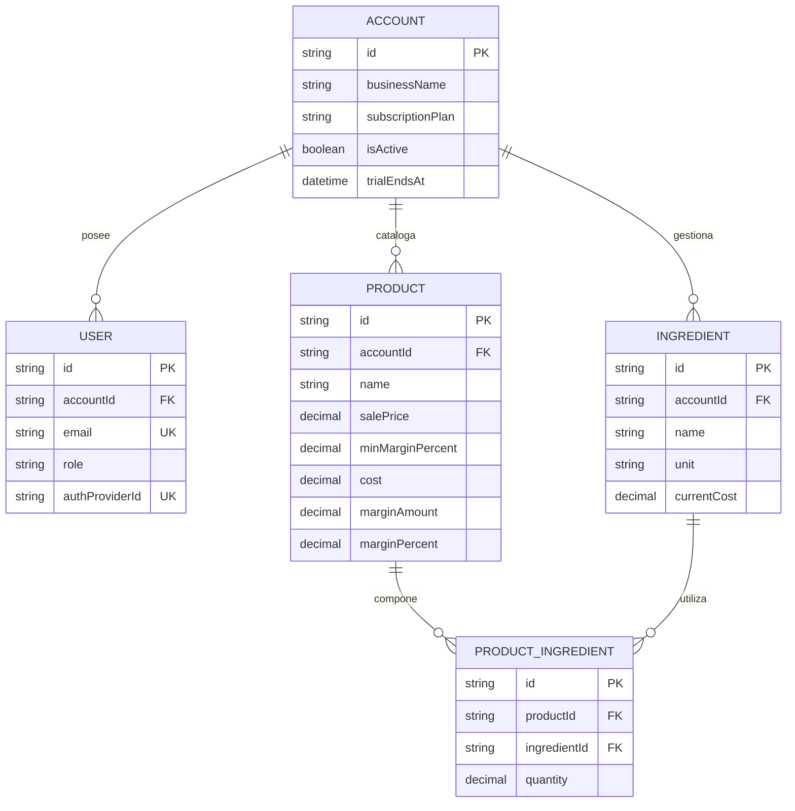
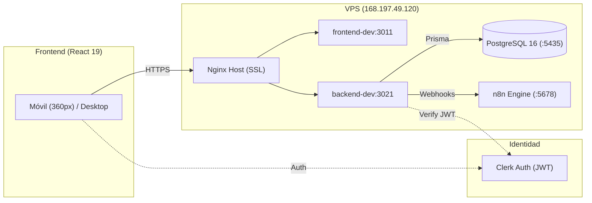

## MARGENX — ENTREGABLE ACADÉMICO PPS
**Materia:** Prácticas Profesionales Supervisadas (PPS) · **Fecha de Corte:** 12/09/2026  
**Repositorio:** [github.com/dgimenezdeveloper/margenx](https://github.com/dgimenezdeveloper/margenx) · **Tablero Kanban:** [GitHub Projects v2 MargenX](https://github.com/users/dgimenezdeveloper/projects/7)

---

### 1. Sprint, fechas e integrantes
* **Sprint 1 (Desarrollo MVP Base):** 05/09/2026 al 18/09/2026 · Corte de control: **12/09/2026** (Día 7 de 14).
* **Integrantes del Equipo:**
  * **Darío Giménez:** Scrum Master, DevOps & Automatización (Lead Infraestructura).
  * **Federico Paal:** Lead Frontend & UX/UI Mobile-First.
  * **Mauricio Barreras:** Lead Backend & Data Architect.
  * **Leandro Herrera:** QA Engineer & Enlace con Cliente Real.

### 2. Comprometido vs. completado
* **Compromiso total del Sprint 1:** 14 Historias / Tareas Técnicas · **30 Story Points (SP)**.
* **Completado al corte (10 historias / 21 SP — 70%):**
  * `#30` Script de Seed idempotente de comercios piloto — [PR #52](https://github.com/dgimenezdeveloper/margenx/pull/52).
  * `#31` Maquetado responsivo *table-to-cards* (360px) y EmptyState — [PR #53](https://github.com/dgimenezdeveloper/margenx/pull/53).
  * `#32` Formularios validados reactivamente con Zod y React Hook Form — [PR #55](https://github.com/dgimenezdeveloper/margenx/pull/55).
  * `#35` Middleware centralizado de errores HTTP — [PR #51](https://github.com/dgimenezdeveloper/margenx/pull/51).
  * `#36` Paginación y ordenamiento server-side en `/api/ingredients` — [PR #57](https://github.com/dgimenezdeveloper/margenx/pull/57).
  * `#37` Colección automatizada de pruebas API en Postman/Newman — [PR #56](https://github.com/dgimenezdeveloper/margenx/pull/56).
  * `#39` Matriz de pruebas manuales Gherkin y contratos HTTP — [PR #54](https://github.com/dgimenezdeveloper/margenx/pull/54).
  * `#40` Pipeline de Despliegue Continuo (CD) a VPS con Docker Hub — [PR #58](https://github.com/dgimenezdeveloper/margenx/pull/58).
  * `#41` Automatización de migraciones de Prisma en el deploy — [PR #59](https://github.com/dgimenezdeveloper/margenx/pull/59).
  * `#42` Notificaciones automáticas de CI/CD en Discord — [PR #63](https://github.com/dgimenezdeveloper/margenx/pull/63).
* **En revisión / Peer Review (3 historias / 7 SP — 23.3%):**
  * `#29` y `#33` Integración Frontend ↔ Backend, rutas protegidas y API — [PR #60](https://github.com/dgimenezdeveloper/margenx/pull/60).
  * `#61` Sincronización de arquitectura VPS, SAD y backlog — [PR #62](https://github.com/dgimenezdeveloper/margenx/pull/62).
* **En progreso activo (1 historia / 2 SP — 6.7%):**
  * `#38` Colección automatizada en Postman para Productos (QA local).

### 3. Demo y estado operativo
* **Entorno Staging (VPS):** [https://dev.margenx.tech](https://dev.margenx.tech) (SSL Let's Encrypt).
* **API Backend Healthcheck:** [https://api-dev.margenx.tech/api/health](https://api-dev.margenx.tech/api/health) (`status: ok`, entorno `staging`).
* **Verificable en vivo:** Autenticación con Clerk, catálogo de Insumos con ordenamiento server-side, validación reactiva (bloqueo de costos $\le 0$), vista adaptativa *table-to-cards* en 360px, persistencia PostgreSQL 16 y CD automático con alertas en Discord.

### 4. Commits del período
* **Compare oficial en GitHub:** [v0.1.0...develop](https://github.com/dgimenezdeveloper/margenx/compare/v0.1.0...develop) · [Historial en develop](https://github.com/dgimenezdeveloper/margenx/commits/develop)
* **Hitos verificables auditados:** `d9fe487` (Postman Insumos), `f19d9ae` (Validaciones Zod), `cc9000e` (Paginación), `2d5432c` (Migraciones Prisma en CD), `ce67225` (Notificaciones Discord).

### 5. Impedimentos y mitigaciones
* **Técnico superado:** Costo de Azure Flexible Server incompatible con créditos académicos; resuelto consolidando cómputo y persistencia 100% en VPS a costo $0 (documentado en **ADR-002**).
* **Cátedra:** Sin bloqueos activos. Se presenta la escala de estimación unificada (Story Points / Tallas) para validación docente.

### 6. Horas dedicadas por integrante

| Integrante | Rol en el Proyecto | Horas Sprint 0 (2 sem) | Horas Sprint 1 (1ª sem) | Total Acumulado |
| :--- | :--- | :---: | :---: | :---: |
| **Darío Giménez** | Scrum Master, DevOps & Automatización | 24 h | 12 h | **36 h** |
| **Federico Paal** | Lead Frontend & UX/UI Mobile-First | 22 h | 11 h | **33 h** |
| **Mauricio Barreras** | Lead Backend & Data Architect | 22 h | 11 h | **33 h** |
| **Leandro Herrera** | QA Engineer & Enlace Cliente | 20 h | 11 h | **31 h** |
| **TOTALES** | *(Horas acreditables de práctica)* | **88 h** | **45 h** | **133 h** |

### 7. Compromiso del próximo período
* **Cierre Sprint 1 (18/09):** Fusión de PR #60 (Auth/API) y PR #62 (SAD); cierre de suite Postman #38.
* **Inicio Sprint 2 (19/09 - 02/10):** Relación transaccional de Recetas (`ProductIngredient`), motor de cálculo matemático de costo/margen en vivo, soporte de productos borrador "Sin Receta" y suite E2E en Playwright (`#47`).

---
<!-- SALTO DE PÁGINA PARA EXPORTAR A PDF -->
---

### DOCUMENTACIÓN TÉCNICA DE BASE

### 1. Requerimientos Funcionales y No Funcionales
* **RF:** RF-01 (ABM Insumos), RF-02 (Alta Productos), RF-03 (Recetas compuestas BOM), RF-04 (Costo total elaboración), RF-05 (Cálculo de margen nominal en pesos y porcentaje), RF-06 (Umbral de margen mínimo), RF-07 (Semáforo visual: verde ≥ 30% y rojo < 30%), RF-08 (Recálculo en cascada), RF-09 (Sorting server-side), RF-10 (Multi-tenant estricto por `accountId`), RF-11 (Roles Admin/Colaborador), RF-12 (Ocultamiento de márgenes a Colaborador), RF-16 (Productos sin costear/borrador).
* **RNF:** RNF-01 (Carga < 2s), RNF-02 (Mobile-First 360px), RNF-03 (Auth JWT asimétrico Clerk), RNF-04 (Recálculo reactivo en cliente), RNF-05 (Validación Zod estricta), RNF-06 (Error handling uniforme `{"error": "..."}`), RNF-08 (Borrado seguro `409 Conflict` en insumos usados en recetas).

### 2. Backlog y Estimación del Sprint 1
🔗 **Tablero Oficial en Vivo (Historias, Gherkin y Estimación):** [github.com/users/dgimenezdeveloper/projects/7/views/6](https://github.com/users/dgimenezdeveloper/projects/7/views/6)  
*Las 14 historias de usuario con sus estimaciones (Story Points / Tallas) y Criterios de Aceptación Gherkin (Dado/Cuando/Entonces) se gestionan y auditan en tiempo real en el tablero de GitHub Projects.*

| Módulo / Área Técnica | Historias / Tareas del Sprint 1 | Estimación Total | Estado |
|:---|:---|:---:|:---:|
| **Frontend & UX** | `#31` UI Cards, `#32` Zod, `#29` ClerkProvider, `#33` Consumo API | **10 SP** (3 S / 1 M) | 50% Done / 50% Review |
| **Backend & Datos** | `#35` Middleware Errores, `#36` Paginación, `#30` Seed Idempotente | **7 SP** (3 S) | 100% Done |
| **DevOps & Infra** | `#40` CD VPS Docker, `#41` Migraciones Prisma, `#42` Discord, `#61` SAD | **9 SP** (3 S / 1 M) | 75% Done / 25% Review |
| **QA & Testing** | `#39` Matriz Gherkin, `#37` Postman Insumos, `#38` Postman Productos | **6 SP** (3 S) | 67% Done / 33% Progress |
| **TOTAL SPRINT 1** | **14 Historias priorizadas (P1 a P4)** | **32 SP** ($\approx$ 130 h) | **70% Completado** |

### 3. Estimación Total del Sprint 1
* **Capacidad Comprometida:** **30 Story Points** 
* **Estado al corte 12/09:** **21 SP Completados (Done)** · **7 SP En Revisión (In Review)** · **2 SP En Progreso (In Progress)**.

### 4. Modelo de Datos

### 5. Diagrama de Arquitectura de Componentes

### 6. Definition of Done (DoD) del Equipo
Una tarjeta se considera **DONE** únicamente cuando: (1) Cuenta con PR originado desde `develop` hacia `develop` con *Conventional Commits*; (2) Posee aprobación formal de al menos un par (Peer Review) y de QA; (3) 0 errores de compilación TypeScript y 0 advertencias de linter; (4) Pipeline de CI (`ci.yml`) en verde; (5) Criterios Gherkin cumplidos con datos verídicos; (6) Interfaz responsive Mobile-First verificada en 360px; (7) Consultas blindadas por `accountId` (multi-tenant); (8) Desplegado y verificado en Staging (`dev.margenx.tech`).