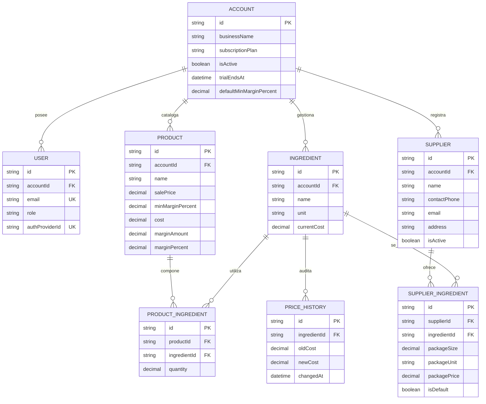
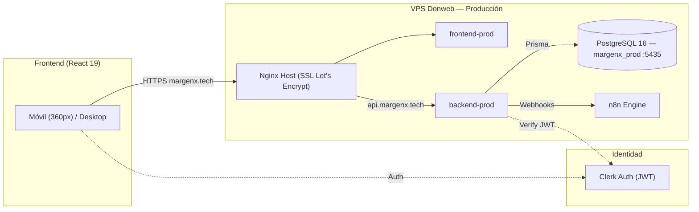

## MARGENX — ENTREGABLE ACADÉMICO PPS

**Materia:** Prácticas Profesionales Supervisadas (PPS) · **Fecha de Corte:** 10/10/2026
**Repositorio:** [github.com/dgimenezdeveloper/margenx](https://github.com/dgimenezdeveloper/margenx) · **Tablero Kanban:** [GitHub Projects v2 MargenX](https://github.com/users/dgimenezdeveloper/projects/7)

---

> ℹ️ **Nota sobre el corte de este reporte.**
> El Sprint 3 arrancó el 03/10/2026 (commit `ab07bbf`, cierre del Sprint 2 / release `v0.3.0`) y cierra oficialmente el 17/10/2026 (15 días). Este envío es un **corte intermedio** (día 8 de 15, sprint todavía abierto): se adelanta a hoy 10/10 en lugar del sábado próximo, para incorporar los cambios de formato que pidió la cátedra antes de esa fecha. Una historia sigue sin cerrar al momento de este corte (`#152` en revisión); `#129` se mergeó esa misma tarde del 10/10 (PR #157), ya reflejado en este reporte.

---

### 1. Sprint, fechas e integrantes que participaron

- **Sprint 3 (Gestión de Proveedores, RBAC y Blindaje Financiero):** 03/10/2026 al 17/10/2026 (15 días) · **Corte de este reporte: 10/10/2026 (día 8 de 15, corte intermedio adelantado — ver nota arriba).**
- **Integrantes que participaron:**
  - **Darío Giménez:** Scrum Master (rol rotativo, Sprint 2) saliente · DevOps & Automatización.
  - **Federico Paal:** Lead Frontend & UX/UI Mobile-First.
  - **Mauricio Barreras:** Lead Backend & Data Architect.
  - **Leandro Herrera:** Scrum Master (rol rotativo, Sprint 3) entrante · QA Engineer & Enlace con Cliente Real.

---

### 2. Comprometido vs. completado

🔗 **Tablero oficial:** [GitHub Projects v2 MargenX](https://github.com/users/dgimenezdeveloper/projects/7)

- **Compromiso total del Sprint 3:** 17 Historias / Tareas Técnicas · **51 Story Points (SP)**.
- **Estado al corte (10/10):** 16 historias completadas (48 SP — 94.1%) · 1 historia en revisión (3 SP — 5.9%, PR abierto).

| Issue | Responsable | Rol | SP | Estado | PR |
| --- | --- | --- | --: | --- | --- |
| `#116` SPRINT3-BE-01 Migración Prisma Supplier/SupplierIngredient/PriceHistory | Mauricio Barreras | Backend | 3 | Done | [PR #132](https://github.com/dgimenezdeveloper/margenx/pull/132) |
| `#117` SPRINT3-BE-02 CRUD de Proveedores + Historial de Precios | Mauricio Barreras | Backend | 5 | Done | [PR #137](https://github.com/dgimenezdeveloper/margenx/pull/137) |
| `#118` SPRINT3-BE-03 Conversión de Empaques Mayoristas | Mauricio Barreras | Backend | 3 | Done | [PR #144](https://github.com/dgimenezdeveloper/margenx/pull/144) |
| `#119` SPRINT3-BE-04 Middleware RBAC y Sanitización Financiera | Mauricio Barreras | Backend | 3 | Done | [PR #143](https://github.com/dgimenezdeveloper/margenx/pull/143) |
| `#120` SPRINT3-BE-05 Endpoints de Métricas del Dashboard | Mauricio Barreras | Backend | 3 | Done | [PR #139](https://github.com/dgimenezdeveloper/margenx/pull/139) |
| `#121` SPRINT3-FE-01 Dashboard con Métricas Reales de la API | Federico Paal | Frontend | 3 | Done | [PR #142](https://github.com/dgimenezdeveloper/margenx/pull/142) |
| `#122` SPRINT3-FE-02 Semáforo de Margen y Gráficos Recharts | Darío Giménez | Frontend | 3 | Done | [PR #146](https://github.com/dgimenezdeveloper/margenx/pull/146) |
| `#123` SPRINT3-FE-03 Adaptación de UI por Rol (RBAC) | Federico Paal | Frontend | 3 | Done | [PR #145](https://github.com/dgimenezdeveloper/margenx/pull/145) |
| `#124` SPRINT3-FE-04 Gestión de Proveedores y Calculadora de Empaques | Federico Paal | Frontend | 5 | Done | [PR #147](https://github.com/dgimenezdeveloper/margenx/pull/147) |
| `#125` SPRINT3-FE-05 Historial de Variaciones de Costo | Darío Giménez | Frontend | 2 | Done | [PR #140](https://github.com/dgimenezdeveloper/margenx/pull/140) |
| `#126` SPRINT3-QA-01 Protocolo de Pruebas In-Situ (360px) | Leandro Herrera | QA | 3 | Done* | [PR #154](https://github.com/dgimenezdeveloper/margenx/pull/154) |
| `#127` SPRINT3-QA-02 Suite E2E de Seguridad RBAC | Leandro Herrera | QA | 3 | Done | [PR #148](https://github.com/dgimenezdeveloper/margenx/pull/148) |
| `#128` SPRINT3-QA-03 Colección Postman de Precisión de Conversión | Leandro Herrera | QA | 2 | Done | [PR #150](https://github.com/dgimenezdeveloper/margenx/pull/150) |
| `#129` SPRINT3-DEVOPS-01 Optimización de Imágenes Docker y Monitoreo VPS | Darío Giménez | DevOps | 3 | Done** | [PR #157](https://github.com/dgimenezdeveloper/margenx/pull/157) |
| `#149` SPRINT3-FE-06 Blindaje Defensivo UI ante Datos Sanitizados | Federico Paal | Frontend | 2 | Done | [PR #151](https://github.com/dgimenezdeveloper/margenx/pull/151) |
| `#152` SPRINT3-FE-07 Comparativa de Proveedores y Conmutación de Predeterminado | Federico Paal | Frontend | 3 | En revisión | [PR #156](https://github.com/dgimenezdeveloper/margenx/pull/156) |
| `#153` SPRINT3-BE-07 Upsert y Actualización de Precios de Proveedor | Mauricio Barreras | Backend | 2 | Done | [PR #155](https://github.com/dgimenezdeveloper/margenx/pull/155) |

\* `#126` tiene el protocolo escrito mergeado, pero la ejecución presencial en los comercios piloto y el acta de conformidad siguen pendientes — ver Sección 5.

\*\* `#129` quedó aprobado y mergeado el 10/10 a pedido del SM; el ítem del DoD de la issue sobre el webhook de alerta de Discord por saturación de memoria no se implementó en este PR — ver Sección 5.

*Además de estas 17 historias formales, el período incluyó 8 ajustes técnicos menores de UI/UX previos al inicio formal del naming `SPRINT3-` (issues `#108`–`#115`: confirmaciones preventivas, normalización visual, redondeo de margen sugerido), ya cerrados — no se les asignó SP individual porque no siguieron el template de Historia de Usuario.*

---

### 3. Demo: qué se puede ver funcionando y en qué URL

- **Entorno de Producción:** [https://margenx.tech](https://margenx.tech) (SSL Let's Encrypt).
- **API Backend:** [https://api.margenx.tech](https://api.margenx.tech) *(confirmar con Darío Giménez la URL exacta de healthcheck vigente en producción antes de entregar — no se encontró documentada en los entregables previos, solo la de Staging).*
- **Verificable en vivo:**
  - **Gestión de proveedores y empaques mayoristas** (`/insumos` → ficha de insumo → "Proveedores y Empaques"): carga manual de presentaciones (ej. "Bolsa 50 kg a $35.000"), cálculo reactivo del costo unitario equivalente y actualización del costo activo del insumo (`#124`, `#153`).
  - **RBAC completo end a end:** un colaborador (`colab.panaderia@hotmail.com`) ve únicamente nombre y precio de venta en `/productos` y `/dashboard`, sin acceso a `/insumos` ni a ningún dato de costo/margen, ni en el DOM ni en la red (`#119`, `#123`, `#149`).
  - **Dashboard con métricas reales**: tarjetas de insumos activos, productos en riesgo y margen promedio calculadas sobre la cuenta real, más el histograma de distribución de salud financiera (`#120`, `#121`, `#122`).
  - **Historial de variaciones de costo** por insumo, con porcentaje de aumento/disminución (`#125`).
  - **Límites de memoria y rotación de logs** en los 6 contenedores de la VPS, confinando el stack a ~2.8 GB (`#129`).
  - **Suite E2E de Playwright** (incluida `rbac-security.spec.ts`) y **colección Postman/Newman de precisión aritmética** corriendo en CI (`#127`, `#128`).

---

### 4. Commits del período

- **Compare oficial en GitHub:** [v0.3.0...develop](https://github.com/dgimenezdeveloper/margenx/compare/v0.3.0...develop) · [Historial en develop](https://github.com/dgimenezdeveloper/margenx/commits/develop)
- **Hitos verificables, con hash de commit:**
  - `6994f44` — Migración Prisma: modelos Supplier/SupplierIngredient/PriceHistory (`#116`).
  - `c45217d` — CRUD de Proveedores y registro automático de historial de precios (`#117`).
  - `fe05fdf` — Lógica de conversión de empaques mayoristas (`#118`).
  - `2270ab5` — Middleware RBAC y sanitización financiera para `COLLABORATOR` (`#119`).
  - `895cff3` — Endpoints de métricas del Dashboard (`#120`).
  - `747c6e8` — Dashboard integrado con métricas reales de la API (`#121`).
  - `906f069` — Semáforo de margen estandarizado + histograma (`#122`).
  - `1ea6c12` — Adaptación de UI por rol / ocultamiento financiero (`#123`).
  - `8a4df71` — Gestión de proveedores y calculadora de empaques (`#124`).
  - `9dc31dc` — Visualización del historial de variaciones de costo (`#125`).
  - `2f330c0` — Protocolo de pruebas in-situ 360px (`#126`).
  - `c0a1e6a` — Suite E2E RBAC `rbac-security.spec.ts` (`#127`).
  - `b83a3aa` — Colección Postman/Newman de precisión de conversión (`#128`).
  - `4d72f15` — Blindaje defensivo UI ante datos financieros sanitizados (`#149`).
  - `aaee9b3` — Upsert y actualización de precios de presentación de proveedor (`#153`).
  - `d939b3d` — Optimización de imágenes Docker y confinamiento de límites de memoria en VPS (`#129`).

---

### 5. Impedimentos y qué necesitan de la cátedra

- **Resuelto:** El entorno local de QA tenía el Prisma Client y las migraciones desactualizadas respecto al schema con los nuevos modelos de proveedores, lo que bloqueaba validar la colección Postman del `#128` con un 401/error de cliente desactualizado → se resolvió corriendo `prisma generate` + `migrate deploy` + `db seed` antes de validar.
- **Resuelto:** `#152` (PR #156) dependía de un comportamiento de backend (upsert sin error 409) que todavía no estaba en `develop` cuando se abrió el PR → quedó bloqueado hasta mergear `#153` (PR #155), que ya se mergeó hoy 10/10.
- **Resuelto:** `#129` (PR #157) se aprobó y mergeó el 10/10 a pedido del SM. Queda como seguimiento técnico, no bloqueante para el cierre de la historia: el ítem del DoD de la issue sobre el webhook de n8n que alerte a Discord ante un uso de memoria de la VPS superior al 85% no se implementó en este PR — a cargar como tarea técnica aparte si el equipo decide sostener ese criterio.
- **Resuelto:** el corte de este reporte (día 8 de 15) es un corte intermedio adelantado a pedido de la cátedra, para incorporar los cambios de formato solicitados antes del envío regular del sábado próximo — el cierre formal de Sprint 3 sigue siendo el 17/10.
- **Activo (interno):** `#152` en revisión, pendiente de aprobación final.
- **Activo (interno):** la corrección del Sprint Review del 03/10 sobre "eliminar el deslogueo cada 15 minutos" todavía no tiene una issue abierta en el repositorio — pendiente de cargar y resolver.

---

### 6. Horas dedicadas por integrante

| Integrante | Rol en el Proyecto | Horas Sprint 0 (2 sem) | Horas Sprint 1 (2 sem) | Horas Sprint 2 (1ª sem) | Horas Sprint 3 (al corte) | Total Acumulado |
| :--- | :--- | :---: | :---: | :---: | :---: | :---: |
| **Darío Giménez** | DevOps & Automatización | 24 h | 24 h | 13 h | 12 h | **73 h** |
| **Federico Paal** | Lead Frontend & UX/UI Mobile-First | 22 h | 22 h | 12 h | 12 h | **68 h** |
| **Mauricio Barreras** | Lead Backend & Data Architect | 22 h | 22 h | 12 h | 12 h | **68 h** |
| **Leandro Herrera** | QA Engineer & Enlace Cliente / SM entrante | 20 h | 22 h | 12 h | 12 h | **66 h** |
| **TOTALES** | *(Horas acreditables de práctica)* | **88 h** | **90 h** | **49 h** | **48 h** | **275 h** |

*La columna "Horas Sprint 2 (1ª sem)" reproduce la cifra ya cerrada en `entrega-pps-sprint-2.md` — es la última cifra oficial disponible para ese período, ya que la 2ª semana de Sprint 2 no quedó registrada en un entregable propio. "Horas Sprint 3" son las horas del equipo desde el lunes pasado hasta hoy (10/10).*

---

### 7. Compromiso del próximo período

- **Cerrar `#152`** (PR #156, ya desbloqueado tras mergear `#153`): re-ejecutar la validación manual contra `develop` actualizado y aprobar.
- **Evaluar el webhook de Discord** pendiente del DoD de `#129` (alerta de saturación de memoria de la VPS) y, si el equipo lo sostiene como criterio, cargarlo como tarea técnica aparte.
- **Cargar y resolver la issue pendiente** sobre el deslogueo automático cada 15 minutos (corrección del Sprint Review 03/10).
- **Ejecutar `#126` en terreno:** visita presencial a Panadería Central y Química GyJ siguiendo `docs/qa/protocolo-pruebas-insitu-sprint3.md`, completar la bitácora de evidencia y redactar + firmar el acta de conformidad en `docs/retrospectivas/`.
- **Cierre formal de Sprint 3:** 17/10/2026 — entregable de cierre con el resto de las historias cerradas y el acta de `#126`.

---
<!-- SALTO DE PÁGINA PARA EXPORTAR A PDF -->
---

### DOCUMENTACIÓN TÉCNICA DE BASE

#### 1. Requerimientos Funcionales y No Funcionales

Lista base (Sprint 1), vigente: **RF:** RF-01 (ABM Insumos), RF-02 (Alta Productos), RF-03 (Recetas compuestas BOM), RF-04 (Costo total elaboración), RF-05 (Cálculo de margen nominal en pesos y porcentaje), RF-06 (Umbral de margen mínimo), RF-07 (Semáforo visual: verde ≥ 30% y rojo < 30%), RF-08 (Recálculo en cascada), RF-09 (Sorting server-side), RF-10 (Multi-tenant estricto por `accountId`), RF-11 (Roles Admin/Colaborador), RF-12 (Ocultamiento de márgenes a Colaborador), RF-16 (Productos sin costear/borrador). **RNF:** RNF-01 (Carga < 2s), RNF-02 (Mobile-First 360px), RNF-03 (Auth JWT asimétrico Clerk), RNF-04 (Recálculo reactivo en cliente), RNF-05 (Validación Zod estricta), RNF-06 (Error handling uniforme `{"error": "..."}`), RNF-08 (Borrado seguro `409 Conflict` en insumos usados en recetas).

**Extensión funcional del Sprint 3** *(sin numeración RF/RNF formal asignada todavía en la documentación base — pendiente de incorporar al listado oficial)*: gestión de proveedores y presentaciones de empaque mayorista con cálculo de costo unitario equivalente (`#116`–`#118`, `#124`, `#153`); registro automático de historial de precios (`#117`, `#125`); sanitización server-side de campos financieros para el rol `COLLABORATOR`, con doble barrera (backend + UI) (`#119`, `#123`, `#149`); endpoints consolidados de métricas para el Dashboard (`#120`, `#121`); límites de memoria y rotación de logs por contenedor en la VPS (`#129`).

#### 2. Backlog y Estimación del Sprint 3

🔗 **Tablero Oficial en Vivo:** [github.com/users/dgimenezdeveloper/projects/7](https://github.com/users/dgimenezdeveloper/projects/7)

| Módulo / Área Técnica | Historias / Tareas del Sprint 3 | Estimación Total | Estado al corte |
| :--- | :--- | :---: | :---: |
| **Backend & Datos** | `#116`–`#120` Proveedores, empaques, RBAC, métricas · `#153` Upsert de precios | **19 SP** | 100% Done |
| **Frontend & UX** | `#121`–`#125` Dashboard, semáforo, RBAC UI, proveedores, historial · `#149` Blindaje UI · `#152` Comparativa proveedores | **21 SP** | 86% Done / 14% En Revisión |
| **QA & Testing** | `#126` Protocolo in-situ · `#127` E2E RBAC · `#128` Postman precisión | **8 SP** | 100% Done* |
| **DevOps & Infra** | `#129` Optimización Docker/VPS | **3 SP** | 100% Done |
| **TOTAL SPRINT 3** | **17 Historias priorizadas (P1 a P3)** | **51 SP** | **94.1% Completado al corte** |

\* `#126` completo en su alcance documental; la ejecución presencial queda fuera de este corte (ver Sección 5).

#### 3. Modelo de Datos (extendido en Sprint 3)

#### 4. Diagrama de Arquitectura de Componentes (Producción)

*Nota: diagrama actualizado tras el merge de `#129` (PR #157, 10/10) — refleja los límites de memoria efectivamente aplicados (Postgres 1 GB, n8n 512 MB, backend 512 MB c/u, frontend 128 MB c/u; techo del stack ~2.8 GB) y el puerto de Postgres ya no expuesto a internet (bindeado a `127.0.0.1:5435`).*

#### 5. Definition of Done (DoD) del Equipo

Una tarjeta se considera **DONE** únicamente cuando: (1) Cuenta con PR originado desde `develop` hacia `develop` con *Conventional Commits*; (2) Posee aprobación formal de al menos un par (Peer Review) y de QA; (3) 0 errores de compilación TypeScript y 0 advertencias de linter; (4) Pipeline de CI (`ci.yml`) en verde; (5) Criterios Gherkin cumplidos con datos verídicos; (6) Interfaz responsive Mobile-First verificada en 360px; (7) Consultas blindadas por `accountId` (multi-tenant); (8) Desplegado y verificado en Staging antes de promover a Producción; (9) *(incorporado en Sprint 3)* para toda respuesta de API que exponga datos financieros, verificar que el rol `COLLABORATOR` reciba el payload sanitizado tanto a nivel de red como de DOM.
