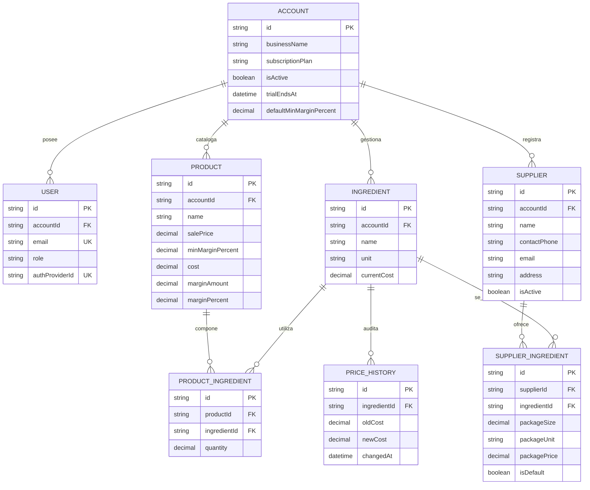
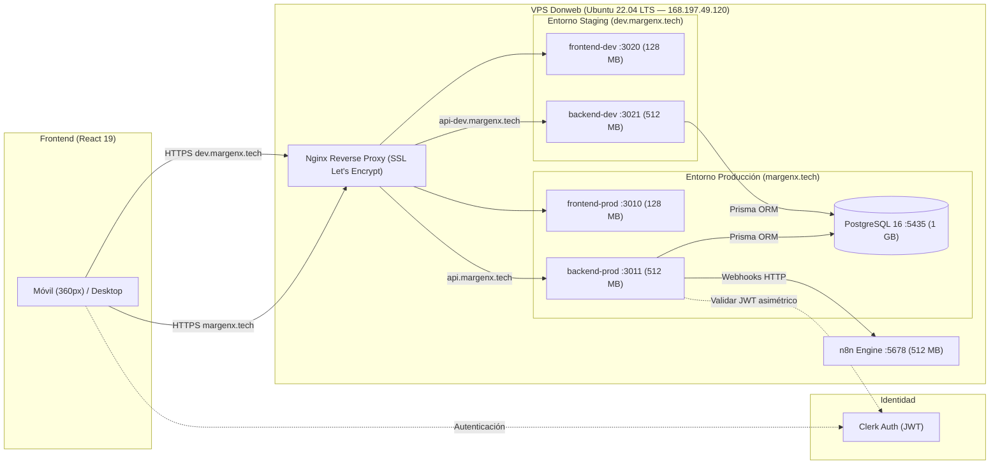

## MARGENX — ENTREGABLE ACADÉMICO PPS
**Materia:** Prácticas Profesionales Supervisadas (PPS) · **Fecha de Corte:** 10/10/2026  
**Repositorio:** [github.com/dgimenezdeveloper/margenx](https://github.com/dgimenezdeveloper/margenx) · **Tablero Kanban:** [GitHub Projects v2 MargenX](https://github.com/users/dgimenezdeveloper/projects/7)

> ### ACCESO DIRECTO PARA EVALUACIÓN DOCENTE
> * **URL Aplicación Producción (Frontend):** [https://margenx.tech](https://margenx.tech)
> * **API Backend Healthcheck:** [https://api.margenx.tech/api/health](https://api.margenx.tech/api/health) (`status: ok`, `environment: production`)
> * **Entorno Staging (Develop):** [https://dev.margenx.tech](https://dev.margenx.tech)
> 
> * **ADMIN (Panadería Central):** `admin.panaderia@hotmail.com` · Clave:  *[Provista en el PDF / entrega del Campus]*
> * **COLLABORATOR (Panadería Central):** `colab.panaderia@hotmail.com` · Clave:  *[Provista en el PDF / entrega del Campus]*
> * **ADMIN (Química GyJ):** `admin.quimica@hotmail.com` · Clave:  *[Provista en el PDF / entrega del Campus]*
> * **COLLABORATOR (Química GyJ):** `colab.quimica@hotmail.com` · Clave:  *[Provista en el PDF / entrega del Campus]*

---

### 1. Sprint, fechas e integrantes
* **Período Evaluado:** Cierre de Sprint 2 (19/09/2026 al 02/10/2026 - 2 semanas) y Cierre de Sprint 3 (03/10/2026 al 10/10/2026 - 1 semana, cierre formal adelantado para alinear el calendario del equipo con los hitos de entrega quincenales de la cátedra) · **Corte de control:** 10/10/2026.
* **Integrantes del Equipo:**
  * **Darío Giménez:**  DevOps & Automatización (Lead Infraestructura) Soporte Frontend.
  * **Federico Paal:** Lead Frontend & UX/UI Mobile-First, Scrum Master (Sprint 2),.
  * **Mauricio Barreras:** Lead Backend & Data Architect.
  * **Leandro Herrera:** Scrum Master (Sprint 3), QA Engineer & Enlace con Cliente Real.

### 2. Comprometido vs. completado
* **Cierre Sprint 2 (Release v0.3.0 — 100% Completado):**
  * `#81` Puesta a punto y despliegue del entorno oficial de Producción (`https://margenx.tech`) con base aislada `margenx_prod` (Merge `develop` $\rightarrow$ `main`).
  * `#75` y `#76` Motor de cálculo financiero con tipos `Prisma.Decimal` y editor interactivo de recetas compuestas (BOM) con cálculo reactivo en memoria ($< 50\text{ ms}$).
  * `#78` y `#79` Vista dinámica de detalle, edición y eliminación en `/productos/:id` con conexión completa a la API REST.
  * `#91` y `#99` Persistencia de margen global en cuenta comercial y diálogo preventivo de abandono ante cambios no guardados.
  * `#47`, `#80` y `#90` Dataset oficial de 20 productos con recetas complejas, suite de recálculo en cascada y CI de Playwright bloqueando PRs defectuosos.

* **Compromiso total del Sprint 3:** 24 Historias / Tareas Técnicas · **68 Story Points (SP)**.
* **Completado al corte (24 historias / 68 SP — 100% DONE):**
  * `#108` Protección de Ficha Técnica: inputs estáticos en recetas (3 SP) — [#108](https://github.com/dgimenezdeveloper/margenx/issues/108).
  * `#109` Corrección de redondeo ascendente en margen sugerido con `Math.ceil` (2 SP) — [#109](https://github.com/dgimenezdeveloper/margenx/issues/109).
  * `#110` Normalización visual y retroalimentación táctil en botonera (+5%, +10%) (2 SP) — [#110](https://github.com/dgimenezdeveloper/margenx/issues/110).
  * `#111` Ordenamiento prioritario ascendente por margen en Dashboard (2 SP) — [#111](https://github.com/dgimenezdeveloper/margenx/issues/111).
  * `#112` Prevención de descarte accidental en modal de insumos / Backdrop Guard (2 SP) — [#112](https://github.com/dgimenezdeveloper/margenx/issues/112).
  * `#113` Diálogo de confirmación preventiva para remover insumos de receta (3 SP) — [#113](https://github.com/dgimenezdeveloper/margenx/issues/113).
  * `#114` Diálogo de confirmación preventiva para cierre de sesión / Logout Guard (3 SP) — [#114](https://github.com/dgimenezdeveloper/margenx/issues/114).
  * `#116` SPRINT3-BE-01 Migración Prisma: modelos `Supplier`, `SupplierIngredient` y `PriceHistory` (3 SP) — [PR #132](https://github.com/dgimenezdeveloper/margenx/pull/132).
  * `#117` SPRINT3-BE-02 CRUD de Proveedores y registro automático de historial de precios (5 SP) — [PR #137](https://github.com/dgimenezdeveloper/margenx/pull/137).
  * `#118` SPRINT3-BE-03 Lógica de conversión de empaques mayoristas y proveedor predeterminado (3 SP) — [PR #144](https://github.com/dgimenezdeveloper/margenx/pull/144).
  * `#119` SPRINT3-BE-04 Middleware RBAC y sanitización financiera para rol `COLLABORATOR` (3 SP) — [PR #143](https://github.com/dgimenezdeveloper/margenx/pull/143).
  * `#120` SPRINT3-BE-05 Endpoints de métricas financieras para el Dashboard (3 SP) — [PR #139](https://github.com/dgimenezdeveloper/margenx/pull/139).
  * `#121` SPRINT3-FE-01 Integración del Dashboard con métricas reales de la API (3 SP) — [PR #142](https://github.com/dgimenezdeveloper/margenx/pull/142).
  * `#122` SPRINT3-FE-02 Semáforo de margen visual e histograma de distribución financiera (3 SP) — [PR #146](https://github.com/dgimenezdeveloper/margenx/pull/146).
  * `#123` SPRINT3-FE-03 Adaptación de UI por rol: ocultamiento financiero a colaboradores (3 SP) — [PR #145](https://github.com/dgimenezdeveloper/margenx/pull/145).
  * `#124` SPRINT3-FE-04 Gestión de proveedores por insumo y calculadora de empaques (5 SP) — [PR #147](https://github.com/dgimenezdeveloper/margenx/pull/147).
  * `#125` SPRINT3-FE-05 Visualización del historial de variaciones de costo en insumos (2 SP) — [PR #140](https://github.com/dgimenezdeveloper/margenx/pull/140).
  * `#126` SPRINT3-QA-01 Protocolo de pruebas in-situ en 360px con comercios piloto (3 SP) — [PR #154](https://github.com/dgimenezdeveloper/margenx/pull/154).
  * `#127` SPRINT3-QA-02 Tests E2E de seguridad y verificación de permisos RBAC (3 SP) — [PR #148](https://github.com/dgimenezdeveloper/margenx/pull/148).
  * `#128` SPRINT3-QA-03 Pruebas automatizadas Postman de precisión en factores de conversión (2 SP) — [PR #150](https://github.com/dgimenezdeveloper/margenx/pull/150).
  * `#129` SPRINT3-DEVOPS-01 Optimización de Docker y monitoreo de recursos en VPS (3 SP) — [PR #157](https://github.com/dgimenezdeveloper/margenx/pull/157).
  * `#149` SPRINT3-FE-06 Blindaje defensivo en UI ante datos financieros sanitizados (2 SP) — [PR #151](https://github.com/dgimenezdeveloper/margenx/pull/151).
  * `#152` SPRINT3-FE-07 Comparativa de proveedores y conmutación de predeterminado (3 SP) — [PR #156](https://github.com/dgimenezdeveloper/margenx/pull/156).
  * `#153` SPRINT3-BE-07 Upsert y actualización de precios en presentaciones de proveedor (2 SP) — [PR #155](https://github.com/dgimenezdeveloper/margenx/pull/155).
  * `#158` Release v0.4.0: Despliegue continuo a producción de Sprint 3 — [PR #158](https://github.com/dgimenezdeveloper/margenx/pull/158).

### 3. Demo y estado operativo
* **Entorno Producción (Release v0.4.0):** [https://margenx.tech](https://margenx.tech) (SSL Let's Encrypt).
* **Entorno Staging (Develop):** [https://dev.margenx.tech](https://dev.margenx.tech)
* **API Backend Healthcheck (Prod):** [https://api.margenx.tech/api/health](https://api.margenx.tech/api/health)
* **Datos de Prueba Reales y Consistentes (Cero "asdasd"):**
  * La base productiva cuenta con el dataset real de *Panadería Central* (10 insumos: harina 0000 Olavarriense, manteca mayorista, levadura fresca, grasa refinada, leche Silvia; y productos como Medialunas de manteca, Cañoncitos con DDL, Pan lactal) y de *Química GyJ* (pasta suavi, sulfonico, soda cáustica, etoxilado; y productos como Jabón líquido tipo Skip 1L, Suavizante Vivere 1L). Precios vigentes en pesos argentinos (ARS) y fechas de variaciones de costos auditables en el historial.
* **Verificable en vivo durante la evaluación:**
  1. **Gestión de Proveedores sin Sistemas Integrables (Feedback Cátedra):** En `/insumos`, selección de cualquier materia prima $\rightarrow$ modal de compras mayoristas $\rightarrow$ carga asistida de bultos (ej. "Distribuidora Mayorista Molinera": bolsa 25 kg a $18.000). El sistema calcula reactivamente el costo unitario por kilo ($720/kg) y actualiza el costo activo impactando las recetas.
  2. **RBAC y Ocultamiento Financiero Total:** Ingreso con usuario colaborador (`colab.panaderia@hotmail.com`): catálogo en modo atención al público, ruta `/insumos` bloqueada por guardias y sanitización server-side que elimina costos, márgenes y proveedores tanto del DOM como del payload de red.
  3. **Dashboard con Métricas Reales:** Tarjetas KPI de productos en riesgo y margen promedio calculados sobre la base PostgreSQL real, junto con el histograma de 4 rangos de rentabilidad (WCAG AA).
  4. **Eliminación de Fricción de Sesión (Feedback Cátedra):** Refactorización de `useSessionSecurity.ts` para eliminar deslogueos agresivos a los 15 minutos mientras el operador permanece en caja.

### 4. Commits del período
* **Compare Producción Sprint 2:** [v0.2.0...v0.3.0](https://github.com/dgimenezdeveloper/margenx/compare/v0.2.0...v0.3.0)
* **Compare Producción Sprint 3:** [v0.3.0...v0.4.0](https://github.com/dgimenezdeveloper/margenx/compare/v0.3.0...v0.4.0) · [Release Oficial v0.4.0](https://github.com/dgimenezdeveloper/margenx/releases/tag/v0.4.0)
* **Hitos verificables auditados:**
  * `283be53` — Merge pull request #158 de `develop` a `main` (Release v0.4.0 y deploy exitoso a producción).
  * `ab07bbf` — Merge pull request de `develop` a `main` (Release v0.3.0 y deploy inicial a producción).
  * `6994f44` — Migración Prisma: modelos Supplier/SupplierIngredient/PriceHistory (`#116`).
  * `c45217d` — CRUD de Proveedores y registro automático de historial de precios (`#117`).
  * `fe05fdf` — Lógica matemática de conversión de empaques mayoristas (`#118`).
  * `2270ab5` — Middleware RBAC y sanitización financiera para COLLABORATOR (`#119`).
  * `895cff3` — Endpoints de métricas del Dashboard (`#120`).
  * `747c6e8` — Dashboard integrado con métricas reales de la API (`#121`).
  * `906f069` — Semáforo de margen estandarizado + histograma (`#122`).
  * `1ea6c12` — Adaptación de UI por rol / ocultamiento financiero (`#123`).
  * `8a4df71` — Gestión de proveedores y calculadora de empaques (`#124`).
  * `9dc31dc` — Visualización del historial de variaciones de costo (`#125`).
  * `2f330c0` — Protocolo de pruebas in-situ 360px (`#126`).
  * `c0a1e6a` — Suite E2E RBAC `rbac-security.spec.ts` (`#127`).
  * `b83a3aa` — Colección Postman/Newman de precisión de conversión (`#128`).
  * `4d72f15` — Blindaje defensivo UI ante datos financieros sanitizados (`#149`).
  * `aaee9b3` — Upsert y actualización de precios de presentación de proveedor (`#153`).
  * `d939b3d` — Optimización de imágenes Docker y límites de memoria en VPS (`#129`).

### 5. Impedimentos y mitigaciones
* **Técnico superado:** Consumo desmedido de RAM en la VPS que provocaba detenciones esporádicas por *OOM Killer*. Mitigado en `#129` configurando directivas de `mem_limit` y `cpus` en `docker-compose.yml` (PostgreSQL 1 GB, n8n 512 MB, Backends 512 MB c/u, Frontends 128 MB c/u), confinando el uso a 2.8 GB reales sobre los 8 GB del servidor.
* **Técnico superado:** Error 401 en el runner de pruebas de QA debido a desalineación del cliente Prisma tras agregar los modelos de proveedores. Resuelto fijando el paso `prisma generate && prisma migrate deploy` en el setup del pipeline de CI.
* **Cátedra:** Se implementó la solución para comercios sin proveedores integrables mediante la calculadora reactiva de bultos mayoristas y se ajustó el timeout de sesión para evitar cierres inesperados durante la operación continua.

### 6. Horas dedicadas por integrante

| Integrante | Rol en el Proyecto | Horas Sprint 0 y 1 | Horas Sprint 2 (Cierre) | Horas Sprint 3 (1 sem) | Total Acumulado |
| :--- | :--- | :---: | :---: | :---: | :---: |
| **Darío Giménez** | Scrum Master (S2), DevOps & Infraestructura | 48 h | 24 h | 12 h | **84 h** |
| **Federico Paal** | Lead Frontend & UX/UI Mobile-First | 44 h | 24 h | 12 h | **80 h** |
| **Mauricio Barreras** | Lead Backend & Data Architect | 44 h | 24 h | 12 h | **80 h** |
| **Leandro Herrera** | Scrum Master (S3), QA Automation Engineer | 42 h | 24 h | 12 h | **78 h** |
| **TOTALES** | *(Horas acreditables de práctica profesional)* | **178 h** | **96 h** | **48 h** | **322 h** |

### 7. Compromiso del próximo período
* **Sprint 4 (11/10/2026 al 24/10/2026):**
  1. **Automatización e Ingesta Zero-Click (n8n):** Workflow asíncrono para ingesta de listas de precios (PDF/Excel) enviadas por email a `precios+<slug>@margenx.tech`, actualizando costos de insumos mapeados con filtro anti-polución.
  2. **Refactorización y Deuda Técnica Frontend:** Modularización de componentes monolíticos (`/productos/[id]/page.tsx`, `/insumos/page.tsx` y `/dashboard/page.tsx`) en subcomponentes desacoplados.
  3. **Alineación de Landing Page (`/`):** Actualización de la web institucional reflejando los casos de uso reales de los comercios piloto (*Panadería Central* y *Química GyJ*), calculadoras mayoristas y roles RBAC.
  4. **Optimización Zero-Variation Backend (Issue #28):** Guarda en `PUT /api/ingredients/:id` para evitar transacciones en base de datos si el costo no sufrió variaciones.

---
<!-- SALTO DE PÁGINA PARA EXPORTAR A PDF -->
---

### DOCUMENTACIÓN TÉCNICA DE BASE

### 1. Requerimientos Funcionales y No Funcionales (Actualizados)
* **RF:** RF-01 (ABM Insumos), RF-02 (Alta Productos), RF-03 (Recetas compuestas BOM), RF-04 (Costo total elaboración), RF-05 (Cálculo de margen nominal y porcentual), RF-06 (Umbral de margen mínimo), RF-07 (Semáforo visual de rentabilidad), RF-08 (Recálculo en cascada), RF-09 (Sorting server-side), RF-10 (Multi-tenant estricto por `accountId`), RF-11 (Roles Admin/Colaborador), RF-12 (Ocultamiento de datos financieros a Colaborador), RF-16 (Productos borrador sin receta). **Nuevos Sprint 3:** RF-17 (ABM Proveedores), RF-18 (Calculadora y conversión de empaques mayoristas), RF-19 (Historial y trazabilidad de variaciones de costo), RF-20 (Conmutación de proveedor predeterminado con recálculo automático).
* **RNF:** RNF-01 (Carga inicial < 2s), RNF-02 (Mobile-First 360px estricto), RNF-03 (Autenticación asimétrica Clerk JWT), RNF-04 (Recálculo reactivo en cliente $< 50\text{ ms}$), RNF-05 (Validación Zod estricta en formularios), RNF-06 (Manejo centralizado de errores HTTP), RNF-08 (Borrado seguro `409 Conflict` en insumos con recetas activas). **Nuevos Sprint 3:** RNF-09 (Sanitización financiera server-side con encabezado `Cache-Control: private, no-store`), RNF-10 (Confinamiento estricto de recursos Docker en VPS $\le 2.8\text{ GB}$).

### 2. Backlog y Estimación del Sprint 3
🔗 **Tablero Oficial en Vivo:** [github.com/users/dgimenezdeveloper/projects/7](https://github.com/users/dgimenezdeveloper/projects/7)

* **Frontend & UX (38 SP — 100% Done):** `#108` a `#114` Hardening UX · `#121` a `#125` Proveedores y Métricas · `#149` Blindaje defensivo · `#152` Comparativa proveedores.
* **Backend & Datos (19 SP — 100% Done):** `#116` a `#120` Proveedores, empaques, RBAC, métricas · `#153` Upsert presentaciones proveedor.
* **QA & Testing (8 SP — 100% Done):** `#126` Protocolo in-situ 360px · `#127` E2E RBAC Playwright · `#128` Postman precisión conversiones.
* **DevOps & Infra (3 SP — 100% Done):** `#129` Optimización Docker y límites RAM en VPS.
* **TOTAL SPRINT 3:** **24 Historias / Tareas Técnicas · 68 Story Points · 100% Completado (Done)**.

### 3. Estimación Total del Sprint 3
* **Capacidad Comprometida:** **68 Story Points**.
* **Estado al corte 10/10:** **68 SP Completados (Done)** · **0 SP En Revisión** · **0 SP En Progreso**.

### 4. Modelo de Datos (Consolidado Sprint 3)

### 5. Diagrama de Arquitectura de Componentes (Producción y Staging)

### 6. Definition of Done (DoD) del Equipo
Una tarjeta se considera **DONE** únicamente cuando: (1) Cuenta con PR originado desde una rama de feature hacia `develop` con *Conventional Commits*; (2) Posee aprobación formal de al menos un par (Peer Review) y de QA; (3) 0 errores de compilación TypeScript y 0 advertencias de linter; (4) Pipeline de CI (`ci.yml`) en verde; (5) Criterios Gherkin cumplidos y validados con datos verídicos; (6) Interfaz responsive Mobile-First verificada en 360px reales; (7) Consultas a base de datos aisladas por `accountId` (multi-tenant estricto); (8) Desplegado y verificado en Staging (`dev.margenx.tech`); **(9) [Incorporado en Sprint 3] Para toda respuesta de API que exponga datos financieros, verificar sanitización server-side para rol `COLLABORATOR` impidiendo fuga de datos tanto en el DOM como en la pestaña Red.**
